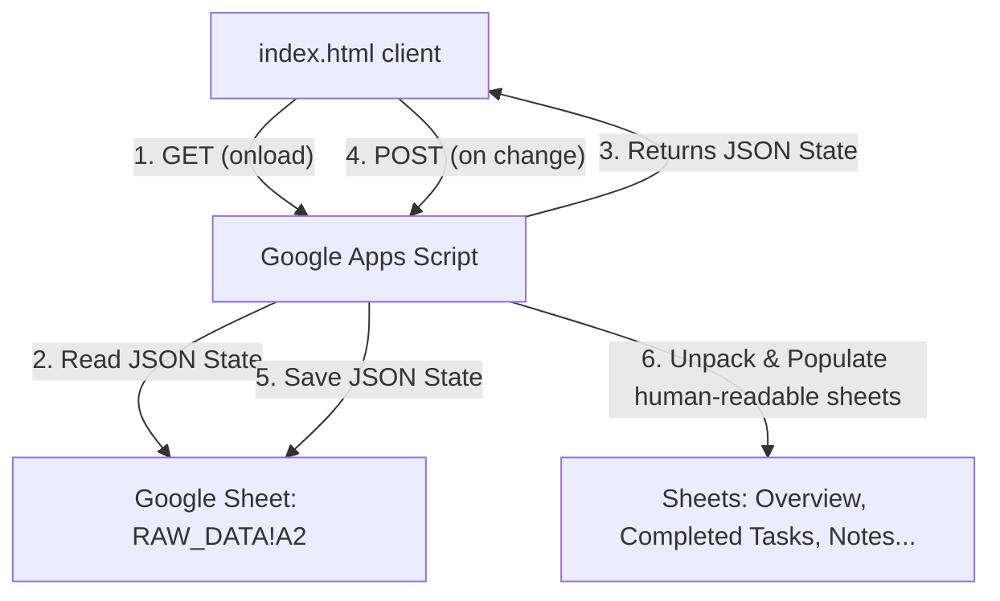

# Space Age Operations Log — Google Sheets Collaboration Architecture

This document defines how the Space Age Operations Log (`index.html`) can be configured to use a Google Sheet as a shared database. This allows multiple users to view, update, and track progress together in real time.

---

## 1. How It Works (Overview)

Instead of saving progress in a single user's browser `localStorage`, the application will make network calls (`GET` and `POST`) to a **Google Apps Script Web App** connected to your Google Sheet:



---

## 2. Google Sheet Setup Instructions

To set up the database, perform the following steps:

1. **Create a new Google Sheet** in your Google Drive. Name it `RWBIADBOSPW Space Log Database`.
2. In the bottom-left, name the default sheet tab as **`RAW_DATA`**.
3. In cell `A1`, type: `Raw State JSON`.
4. In cell `A2`, type: `{}`.
5. In the top menu, go to **Extensions** -> **Apps Script**.
6. Delete any template code in the editor and paste the Apps Script Code below.
7. Click the **Save** icon (disk icon).

---

## 3. Google Apps Script Code

Paste this code into your Google Apps Script editor (`Code.gs`):

```javascript
/**
 * Space Age Operations Log - Collaborative Backend
 * Handles GET (load) and POST (save) requests from the HTML frontend.
 */

// Enable CORS for web requests
function doGet(e) {
  var sheet = SpreadsheetApp.getActiveSpreadsheet().getSheetByName("RAW_DATA");
  if (!sheet) {
    return ContentService.createTextOutput(JSON.stringify({ error: "RAW_DATA sheet not found" }))
                         .setMimeType(ContentService.MimeType.JSON);
  }
  
  var jsonStr = sheet.getRange("A2").getValue();
  if (!jsonStr || jsonStr.trim() === "") {
    jsonStr = "{}";
  }
  
  // Return the raw JSON string with CORS headers allowed by Apps Script ContentService
  return ContentService.createTextOutput(jsonStr)
                       .setMimeType(ContentService.MimeType.JSON);
}

function doPost(e) {
  var jsonString = "";
  
  if (e && e.postData && e.postData.contents) {
    jsonString = e.postData.contents;
  } else {
    return ContentService.createTextOutput(JSON.stringify({ error: "No post content received" }))
                         .setMimeType(ContentService.MimeType.JSON);
  }
  
  var state;
  try {
    state = JSON.parse(jsonString);
  } catch (err) {
    return ContentService.createTextOutput(JSON.stringify({ error: "Invalid JSON format: " + err.message }))
                         .setMimeType(ContentService.MimeType.JSON);
  }
  
  var ss = SpreadsheetApp.getActiveSpreadsheet();
  
  // 1. Save raw JSON state to the RAW_DATA sheet
  var rawSheet = ss.getSheetByName("RAW_DATA") || ss.insertSheet("RAW_DATA");
  rawSheet.getRange("A1").setValue("Raw State JSON");
  rawSheet.getRange("A2").setValue(jsonString);
  
  // 2. Unpack JSON to update human-readable tabs
  updateHumanReadableSheets(ss, state);
  
  return ContentService.createTextOutput(JSON.stringify({ success: true, updated: new Date().toISOString() }))
                       .setMimeType(ContentService.MimeType.JSON);
}

/**
 * Unpacks the JSON state into human-readable, read-only sheets for easy viewing
 */
function updateHumanReadableSheets(ss, state) {
  // --- Tab 1: Overview ---
  var overviewSheet = ss.getSheetByName("Overview") || ss.insertSheet("Overview");
  overviewSheet.clear();
  overviewSheet.appendRow(["Metric", "Value"]);
  overviewSheet.appendRow(["Active Planet", state.activePlanet || "Nauvis"]);
  overviewSheet.appendRow(["Last Updated", state.lastUpdated || new Date().toISOString()]);
  overviewSheet.getRange("A1:B1").setFontWeight("bold").setBackground("#ece5da");

  // --- Tab 2: Completed Tasks ---
  var checksSheet = ss.getSheetByName("Completed Tasks") || ss.insertSheet("Completed Tasks");
  checksSheet.clear();
  checksSheet.appendRow(["Task ID", "Status", "Last Marked Complete"]);
  checksSheet.getRange("A1:C1").setFontWeight("bold").setBackground("#d9480f").setFontColor("#ffffff");
  if (state.checked) {
    Object.keys(state.checked).forEach(function(key) {
      if (state.checked[key]) {
        checksSheet.appendRow([key, "COMPLETED", state.lastUpdated || ""]);
      }
    });
  }

  // --- Tab 3: Custom Tasks ---
  var customSheet = ss.getSheetByName("Custom Tasks") || ss.insertSheet("Custom Tasks");
  customSheet.clear();
  customSheet.appendRow(["Bucket (Planet/Project/Track)", "Task ID", "Task Content"]);
  customSheet.getRange("A1:C1").setFontWeight("bold").setBackground("#7c93a3").setFontColor("#ffffff");
  if (state.custom) {
    Object.keys(state.custom).forEach(function(bucketKey) {
      var tasksList = state.custom[bucketKey] || [];
      tasksList.forEach(function(t) {
        customSheet.appendRow([bucketKey, t.id, t.text]);
      });
    });
  }

  // --- Tab 4: Planet Notes ---
  var notesSheet = ss.getSheetByName("Notes") || ss.insertSheet("Notes");
  notesSheet.clear();
  notesSheet.appendRow(["Location Key", "Notes"]);
  notesSheet.getRange("A1:B1").setFontWeight("bold").setBackground("#f2b33d");
  if (state.notes) {
    Object.keys(state.notes).forEach(function(key) {
      if (state.notes[key] && state.notes[key].trim() !== "") {
        notesSheet.appendRow([key, state.notes[key]]);
      }
    });
  }
}
```

---

## 4. Deploying the Apps Script as a Web App

To make the script accessible to your HTML file:

1. In the Apps Script tab, click the blue **Deploy** button in the top right and select **New deployment**.
2. Click the gear icon next to "Select type" and select **Web app**.
3. Fill in the deployment details:
   - **Description:** `Space Age Operations Log API`
   - **Execute as:** `Me (your-email@gmail.com)` (This is critical: it lets the script write to your spreadsheet even when accessed anonymously).
   - **Who has access:** `Anyone` (This is required so the HTML page can save/load without requiring everyone to log in to Google).
4. Click **Deploy**.
5. You may be prompted to **Authorize Access**. Click "Authorize access", sign in with your Google account, click "Advanced", and then click "Go to Project (unsafe)" -> "Allow".
6. Copy the **Web App URL** shown at the end (it should end in `/exec`). Save this URL; we will add it to the code!

---

## 5. Integrating with `index.html` (For the Next Agent)

When ready to implement this in `index.html`, the following changes should be made to the JavaScript logic:

### Step A: Define Web App URL
Replace or append the Web App URL config at the top of `<script>`:
```javascript
var SCRIPT_URL = "https://script.google.com/macros/s/AKfycbze7v67gF3CHFkYt7GOpNiS3KuIuLamFKuGhSwcdrCpfVrJy3a5p-jOn_ke4Roogrt8jw/exec";
```

### Step B: Replace Load/Save State Logic
Modify `loadState()` and `saveState()` to fetch/push asynchronously:

```javascript
// Global memory state
var state = {};

function initApp() {
  loadStateFromCloud(function() {
    // Once loaded, draw the UI
    renderAll();
  });
}

function loadStateFromCloud(callback) {
  if (!SCRIPT_URL || SCRIPT_URL.includes("YOUR_DEPLOYED_WEB_APP_URL")) {
    // Fallback to local storage if no URL configured
    state = loadLocalState();
    callback();
    return;
  }
  
  document.getElementById("updatedNote").textContent = "Loading progress from cloud...";
  
  fetch(SCRIPT_URL)
    .then(response => response.json())
    .then(data => {
      state = data;
      state.checked = state.checked || {};
      state.removed = state.removed || {};
      state.custom = state.custom || {};
      state.notes = state.notes || {};
      state.lastUpdated = state.lastUpdated || null;
      callback();
    })
    .catch(err => {
      console.error("Cloud load failed, using local storage:", err);
      state = loadLocalState();
      callback();
    });
}

function saveState() {
  state.lastUpdated = new Date().toISOString();
  state.activePlanet = activePlanet;
  
  // 1. Save locally as backup
  try { localStorage.setItem(STORAGE_KEY, JSON.stringify(state)); } catch (e) {}
  renderUpdatedNote();
  
  // 2. Save to cloud
  if (SCRIPT_URL && !SCRIPT_URL.includes("YOUR_DEPLOYED_WEB_APP_URL")) {
    fetch(SCRIPT_URL, {
      method: "POST",
      mode: "no-cors", // Required to avoid Google CORS preflight checks
      headers: {
        "Content-Type": "text/plain" // Plain text avoids CORS preflight OPTIONS request
      },
      body: JSON.stringify(state)
    })
    .then(() => {
      console.log("State synced to Google Sheets successfully.");
    })
    .catch(err => {
      console.error("Failed to sync state to Google Sheets:", err);
    });
  }
}
```

> [!NOTE]
> Setting `mode: "no-cors"` and sending the JSON body as `"text/plain"` allows the browser to perform a "simple request" to Google's redirecting App Script servers. This bypasses browser preflight issues and safely updates the spreadsheet in the background.
